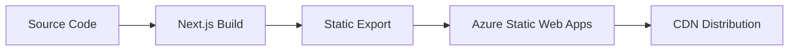

# Architecture Overview

Comprehensive system architecture and technology stack for the Garcia Family Medicine website.

## 🏗️ System Architecture

### Overview

This is a **Next.js 15** application using the **App Router** (`/app` directory) for Garcia Family Medicine's website. The application is configured for **static export** (`output: 'export'`) targeting Azure Static Web Apps deployment.

### High-Level Architecture

```
┌─────────────────┐    ┌─────────────────┐    ┌─────────────────┐
│   User Browser  │────│  Azure Static   │────│   GitHub Repo   │
│                 │    │   Web Apps      │    │                 │
└─────────────────┘    └─────────────────┘    └─────────────────┘
                                │
                                │ Static Files
                                ▼
                       ┌─────────────────┐
                       │   Next.js App   │
                       │   (Static Site) │
                       └─────────────────┘
```

## 🛠️ Technology Stack

### Core Technologies

| Technology | Version | Purpose |
|------------|---------|---------|
| **Next.js** | 15.3.3 | React framework with App Router |
| **React** | 19 | UI library with modern features |
| **Tailwind CSS** | 3.4.10 | Utility-first styling framework |
| **CSS Modules** | - | Component-scoped styling |
| **React Icons** | Latest | Comprehensive icon library |
| **Chart.js** | Latest | Data visualization |
| **Lucide React** | Latest | Modern icon set |

### Development Tools

| Tool | Purpose |
|------|---------|
| **ESLint** | Code linting and quality |
| **Prettier** | Code formatting |
| **PostCSS** | CSS processing |
| **Autoprefixer** | CSS vendor prefixes |

### Deployment Stack

| Component | Technology |
|-----------|------------|
| **Hosting** | Azure Static Web Apps |
| **CDN** | Azure CDN |
| **SSL** | Azure-managed certificates |
| **Git Integration** | GitHub Actions |

## 📁 Directory Structure

### Application Structure

```
garciafamilymedicine.care/
├── app/                        # Next.js App Router (pages)
│   ├── globals.css            # Global styles with Tailwind imports
│   ├── layout.js              # Root layout with font loading
│   ├── page.jsx               # Homepage with carousel
│   ├── care/                  # Medical service pages
│   │   ├── pelvichealth/      # Specialized care pages
│   │   │   ├── page.jsx       # Page component
│   │   │   ├── pelvichealth.module.css # Page styles
│   │   │   └── sections/      # Page sections
│   │   ├── veterans/          # Veterans healthcare
│   │   ├── medicare/          # Medicare services
│   │   ├── mental-health/     # Mental health services
│   │   ├── pain-management/   # Pain management
│   │   ├── telehealth/        # Virtual care services
│   │   ├── weight-management/ # Weight management
│   │   ├── dot-certifications/ # DOT medical exams
│   │   └── independent-medical-examinations/ # IME services
│   ├── contact/               # Contact page
│   ├── events/                # Event system
│   │   ├── current/           # Current events listing
│   │   ├── past/              # Past events archive
│   │   ├── independence-day/  # Specific event pages
│   │   ├── juneteenth/        # Holiday events
│   │   └── pelvic-health-recovery/ # Program events
│   ├── meetthedoctor/         # Doctor biography page
│   └── services/              # General services
│       └── corelift/          # CoreLift™ program
├── components/                 # Reusable React components
│   ├── header/                # Navigation header system
│   │   ├── header.jsx         # Main header component
│   │   ├── header.module.css  # Header styling
│   │   ├── mobile.module.css  # Mobile-specific styles
│   │   └── navdata.js         # Navigation configuration
│   ├── footer/                # Site footer
│   │   ├── footer.jsx         # Footer component
│   │   └── footer.module.css  # Footer styling
│   └── calendar/              # Event calendar system
│       ├── calendar.jsx       # Calendar component
│       └── calendar-events.js # Event data management
├── public/                     # Static assets
│   └── images/                # Organized by page/section
│       ├── homepage/          # Homepage images
│       ├── pelvichealth/      # Pelvic health assets
│       ├── events/            # Event images
│       └── partners/          # Partner logos
├── wiki/                       # Documentation (GitHub Wiki)
├── next.config.mjs             # Next.js configuration
├── tailwind.config.js          # Tailwind configuration
├── postcss.config.mjs          # PostCSS configuration
├── CLAUDE.md                   # Claude Code instructions
├── CHANGELOG.md                # Project changelog
└── README.md                   # Project documentation
```

### Asset Organization

```
public/images/
├── homepage/                   # Homepage-specific images
├── pelvichealth/              # Pelvic health program images
├── events/                    # Event and program images
├── partners/                  # Partner organization logos
└── general/                   # Shared/utility images
```

## 🎨 Styling Architecture

### CSS Organization Strategy

**Global Styles (`app/globals.css`):**
```css
/* Tailwind directives */
@tailwind base;
@tailwind components;
@tailwind utilities;

/* CSS custom properties for theming */
:root {
  --primary-color: #1e40af;
  --secondary-color: #059669;
  --accent-red: #dc2626;
  --accent-purple: #7c3aed;
  --accent-orange: #ea580c;
}

/* Global component patterns */
.btn-primary { /* Reusable button styles */ }
.card-pattern { /* Common card layout */ }
.section-padding { /* Standard section spacing */ }
```

**CSS Modules Pattern:**
- Component-specific styles (e.g., `header.module.css`)
- Page-specific styles (e.g., `pelvichealth.module.css`)
- Mobile-specific overrides (e.g., `mobile.module.css`)

### Design System

**Color Palette:**
```css
:root {
  /* Primary Medical Colors */
  --primary-blue: #1e40af;      /* Main brand */
  --medical-green: #059669;     /* Healthcare/wellness */
  --emergency-red: #dc2626;     /* Urgent care */
  
  /* Specialty Service Colors */
  --mental-health: #7c3aed;     /* Mental health services */
  --veterans: #ea580c;          /* Veterans healthcare */
  --medicare: #10b981;          /* Medicare services */
  --telehealth: #0ea5e9;        /* Virtual care */
  
  /* Neutral Colors */
  --text-primary: #1e293b;
  --text-secondary: #64748b;
  --background: #f8fafc;
  --surface: #ffffff;
}
```

**Typography Scale:**
```css
/* Heading Hierarchy */
h1 { font-size: 3rem; }        /* 48px - Hero titles */
h2 { font-size: 2.5rem; }      /* 40px - Section headers */
h3 { font-size: 1.5rem; }      /* 24px - Subsections */
h4 { font-size: 1.25rem; }     /* 20px - Card titles */

/* Body Text */
body { font-size: 1rem; }      /* 16px - Standard text */
small { font-size: 0.875rem; } /* 14px - Secondary text */
```

**Spacing System:**
```css
/* Consistent spacing scale */
.spacing-xs { padding: 0.5rem; }   /* 8px */
.spacing-sm { padding: 1rem; }     /* 16px */
.spacing-md { padding: 2rem; }     /* 32px */
.spacing-lg { padding: 4rem; }     /* 64px - Section padding */
.spacing-xl { padding: 6rem; }     /* 96px - Large sections */
```

## 📱 Responsive Design System

### Breakpoint Strategy

```javascript
// tailwind.config.js
module.exports = {
  theme: {
    screens: {
      'mobile': {'max': '768px'},  // Mobile-first approach
      'sm': '640px',               // Small tablets
      'md': '768px',               // Tablets
      'lg': '1024px',              // Laptops
      'xl': '1280px',              // Desktops
      '2xl': '1536px',             // Large screens
    }
  }
}
```

### Mobile-First Grid System

```css
/* Default: Mobile layout */
.responsive-grid {
  display: grid;
  grid-template-columns: 1fr;
  gap: 1rem;
}

/* Tablet: 2 columns */
@media (min-width: 768px) {
  .responsive-grid {
    grid-template-columns: repeat(2, 1fr);
    gap: 2rem;
  }
}

/* Desktop: 3 columns */
@media (min-width: 1024px) {
  .responsive-grid {
    grid-template-columns: repeat(3, 1fr);
    gap: 2rem;
  }
}
```

## 🧩 Component Architecture

### Component Hierarchy

```
App Layout (layout.js)
├── Header Component
│   ├── Navigation (desktop)
│   ├── Mobile Menu
│   └── Dropdown Menus
├── Page Content
│   ├── Hero Sections
│   ├── Content Sections
│   └── Call-to-Action
└── Footer Component
    ├── Partner Logos
    ├── Contact Info
    └── Social Links
```

### Component Design Patterns

**Page Structure Pattern:**
```jsx
export default function ServicePage() {
  return (
    <>
      <Header />
      <main className={styles.main}>
        <HeroSection />
        <QuickInfoSection />
        <ServicesSection />
        <ProcessSection />
        <CTASection />
      </main>
      <Footer />
    </>
  )
}
```

**Section Component Pattern:**
```jsx
function ServiceSection({ title, description, services }) {
  return (
    <section className={styles.section}>
      <div className={styles.container}>
        <div className={styles.sectionHeader}>
          <h2>{title}</h2>
          <p>{description}</p>
        </div>
        <div className={styles.servicesGrid}>
          {services.map(service => (
            <ServiceCard key={service.id} {...service} />
          ))}
        </div>
      </div>
    </section>
  )
}
```

## 🔄 Data Management

### Static Data Strategy

**Navigation Configuration (`components/header/navdata.js`):**
```javascript
export const nav_links = [
  {
    label: 'Patient Care Essentials',
    dropdown: {
      links: [
        {
          title: 'Core Medical Services',
          items: [
            { label: 'CoreLift™ Pelvic Health', href: '/services/corelift' }
          ]
        },
        {
          title: 'Specialized Care',
          items: [
            { label: 'Veterans Healthcare', href: '/care/veterans' },
            { label: 'Medicare Services', href: '/care/medicare' },
            // ...additional services
          ]
        }
      ]
    }
  }
]
```

**Event Data Management (`components/calendar/calendar-events.js`):**
```javascript
export const events = [
  {
    id: 1,
    title: 'Pelvic Health Workshop',
    date: '2025-02-15',
    type: 'workshop',
    recurring: 'monthly'
  }
  // ...additional events
]
```

### Content Management Strategy

**Static Content:**
- Service descriptions in component files
- Navigation structure in configuration files
- Event data in JavaScript modules

**Dynamic Content (Future):**
- Blog posts via MDX or headless CMS
- Event management system
- Patient portal integration

## 🚀 Build & Deployment Architecture

### Build Process



### Next.js Configuration

```javascript
// next.config.mjs
/** @type {import('next').NextConfig} */
const nextConfig = {
  output: 'export',              // Static site generation
  trailingSlash: true,          // Azure Static Web Apps compatibility
  images: {
    unoptimized: true           // Required for static export
  },
  experimental: {
    optimizeCss: true           // CSS optimization
  }
}
```

### Deployment Pipeline

```yaml
# GitHub Actions workflow
name: Deploy to Azure Static Web Apps
on:
  push:
    branches: [main]
jobs:
  build-and-deploy:
    runs-on: ubuntu-latest
    steps:
      - uses: actions/checkout@v2
      - name: Setup Node.js
        uses: actions/setup-node@v2
        with:
          node-version: '18'
      - name: Install dependencies
        run: npm ci
      - name: Build application
        run: npm run build
      - name: Deploy to Azure
        uses: Azure/static-web-apps-deploy@v1
```

## 🔐 Security Architecture

### Client-Side Security

**Content Security Policy:**
```javascript
// next.config.mjs
const nextConfig = {
  async headers() {
    return [
      {
        source: '/(.*)',
        headers: [
          {
            key: 'Content-Security-Policy',
            value: "default-src 'self'; script-src 'self' 'unsafe-eval';"
          }
        ]
      }
    ]
  }
}
```

**Environment Variables:**
```bash
# .env.local (not committed)
NEXT_PUBLIC_ANALYTICS_ID=your-analytics-id
SECRET_API_KEY=your-secret-key
```

### Data Protection

- No sensitive patient data stored client-side
- All forms use HTTPS transmission
- Contact forms integrate with secure backend services
- No client-side authentication tokens

## 📊 Performance Architecture

### Optimization Strategies

**Image Optimization:**
```jsx
import Image from 'next/image'

<Image
  src="/images/hero.jpg"
  alt="Garcia Family Medicine"
  width={800}
  height={600}
  priority={true}           // Above-the-fold images
  placeholder="blur"        // Loading placeholder
/>
```

**Code Splitting:**
```jsx
import dynamic from 'next/dynamic'

const HeavyComponent = dynamic(() => import('./HeavyComponent'), {
  loading: () => <LoadingSpinner />
})
```

**Bundle Optimization:**
```javascript
// webpack.config.js (via next.config.mjs)
module.exports = {
  experimental: {
    optimizeCss: true,
    optimizePackageImports: ['react-icons']
  }
}
```

### Performance Metrics

**Target Metrics:**
- **First Contentful Paint**: < 1.5s
- **Largest Contentful Paint**: < 2.5s
- **Cumulative Layout Shift**: < 0.1
- **First Input Delay**: < 100ms

## 🧪 Testing Architecture

### Testing Strategy

**Manual Testing:**
- Cross-browser compatibility testing
- Mobile device testing
- Accessibility testing with screen readers
- Performance testing with Lighthouse

**Automated Testing (Future):**
- Unit tests with Jest
- Integration tests with React Testing Library
- E2E tests with Playwright
- Visual regression testing

## 🔮 Future Architecture Considerations

### Planned Enhancements

**Content Management:**
- Headless CMS integration for blog posts
- Dynamic event management system
- Patient portal functionality

**Advanced Features:**
- Multi-language support (Spanish)
- Progressive Web App capabilities
- Advanced analytics integration
- Patient appointment booking system

**Performance Improvements:**
- Service worker implementation
- Advanced caching strategies
- Image optimization pipeline
- Bundle splitting optimization

---

**Next Steps:** Review [Coding Standards](./coding-standards.md) for code quality guidelines.

---

## 📚 Quick Links

**[← Development Guide](./development-guide.md)** | **[Home](./home.md)** | **[Coding Standards →](./coding-standards.md)**

**Related Pages**: [Getting Started](./getting-started.md) | [Mobile Development](./mobile-development.md) | [Email Integration](./email-integration.md)